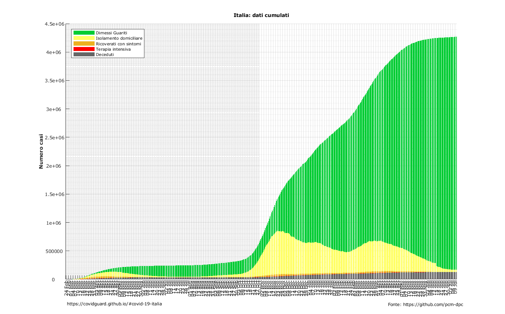
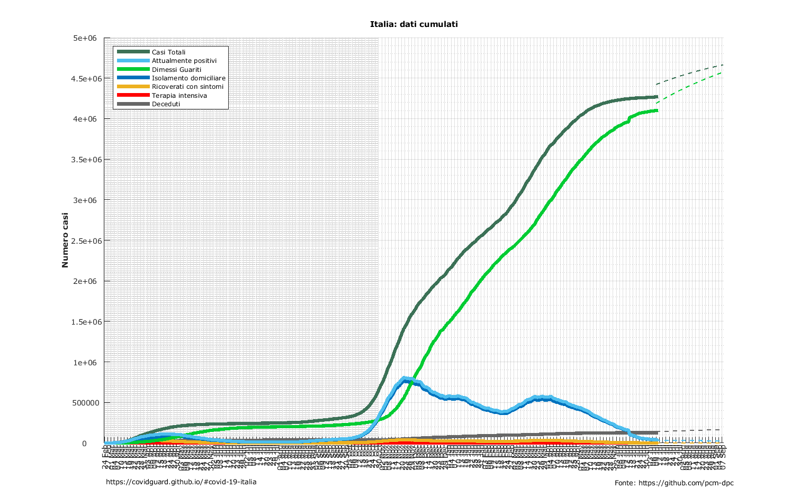
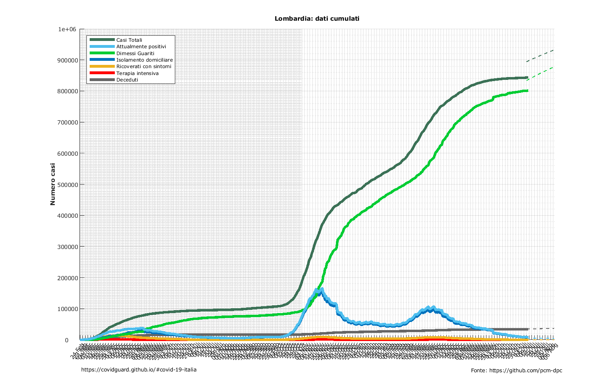

# COVID-19 Italia

{:style="float: right; height: 200px; margin-top: -30px;"}
Lo scopo della pagina è di accrescere la consapevolezza sul covid-19 grazie a semplici analisi grafiche.

Ogni giorno il sito verrà aggiornato tra le ore 18:30 e le 19:30. Se la pagina non dovesse apparire aggiornata dopo quest'ora suggeriamo di provare a svuotare la cache del proprio browser.

Tutti i grafici qui prodotti vengono generati semi automaticamente dai dati ufficiali della Protezione Civile, per ogni informazione aggiuntiva si rimanda al loro [repository ufficiale](https://github.com/pcm-dpc/COVID-19) disponibile su GitHub (fonte: [https://github.com/pcm-dpc/](https://github.com/pcm-dpc/)).

<h2 id="table-of-contents" class="text-delta">Table of contents</h2>
<ul> 
    <li> <a href="#diffusione-spazio-temporale">Italia: Diffusione spazio-temporale</a> </li> 
    <li> <a href="#andamento-italiano-regione-per-regione">Italia: Andamento Italiano regione per regione</a> </li> 
    <li> <a href="#trend-giorno-per-giorno">Italia: Trend giorno per giorno</a> </li> 
    <li> <a href="#tasso-di-mortalita">Italia: Tasso di mortalità regione per regione</a> </li> 
    <li> <a href="#stima-del-numero-cumulato-di-positivi-1">Italia: Stima Positivi Cumulata</a> </li> 
    <li> <a href="#stima-del-picco-di-attualmente-positivi-1">Italia: Stima Positivi</a> </li> 
    <li> <a href="#stima-del-numero-cumulato-di-positivi-1">Lombardia: Stima Positivi Cumulata</a> </li> 
    <li> <a href="#stima-del-picco-di-attualmente-positivi-1">Lombardia: Stima Positivi</a> </li> 
    <!-- <li> <a href="#italia-regioni">Regioni d'Italia</a> </li> -->
    <li> <a href="#dati-giornalieri-cumulati">Regioni Cumulati</a> </li> 
    <li> <a href="#progressione-giornaliera">Regioni Giornalieri</a> </li> 
    <li> <a href="#tamponi">Regioni Tamponi</a> </li> 
    <li> <a href="#dati-di-progressione-percentuale">Province Progressione</a> </li> 
    <li> <a href="#dati-giornalieri-cumulati-1">Province Cumulati</a> </li> 
    <li> <a href="#dati-giornalieri-cumulati-normalizzati-per-popolazione">Province Normalizzati</a> </li> 
    <li> <a href="#progressione-giornaliera-1">Province Giornalieri</a> </li> 
</ul>

**Attenzione**: per visualizzare correttamente il sito si consiglia l'utilizzo di Safari, Chrome o derivati, browser che non hanno pieno supporto degli ultimi standard CSS3 potrebbero non funzionare correttamente.

## ITALIA

### Diffusione spazio-temporale: cumulata
Mappa che mostra la diffusione nel tempo del virus nelle varie province italiane.

### Diffusione spazio-temporale: variazione giornaliera
Mappa che mostra come varia la diffusione nel tempo del virus nelle varie province italiane.

### Andamento Italiano regione per regione
Animazione riassuntiva dell'andamento di diffusione del COVID-19 nelle Regioni d'Italia.

Nota: nella parte bassa del grafico il numero dei casi è troppo limitato perciò la sua variabilità potrebbe essere maggiore.

### Trend giorno per giorno 
Andamento dei dati giornalieri per casi totali, dimessi, in isolamento domiciliare, ricoverati con sintomi, terapie intensive e deceduti, in due rappresentazioni differenti.

### Tasso di mortalità 
Tasso di mortalità calcolato sui casi totali, ovviamente il valore reale è molto più basso, i casi totali conteggiati sono solamente dati dal totale delle persone a cui un tampone è risultato positivo, come noto i casi sommersi sono molti. I valori del grafico sono quindi molto dipendenti dal numero di tamponi effettuati regione per regione.

### Tamponi totali
Numero di tamponi analizzati giorno per giorno su tutto il territorio nazionale e test risultati effettivamente positivi.

### Stima del numero cumulato di positivi
L'evolversi nel tempo di una epidemia può essere descritto da una funzione chiamata Logistica. All'interno della famiglia di funzioni Logistiche, la Legge di Gompertz viene utilizzata per popolazioni poco numerose rispetto alle risorse presenti nell'ambiente che mostrano una crescita inizialmente esponenziale che in seguito si stabilizza, rallentando fino a diventare quasi lineare una volta che la popolazione si avvicina asintoticamente ad un valore di equilibrio.
Il grafico mostra 3 curve di Gompertz (quella di due giorni fa, quella di ieri e quella odierno) fittate sul numero cumulato di positivi d'Italia.
Per la curva odierna è riportata anche l'intervallo di confidenza al 95% dei parametri.
Nell'interpretare questo grafico, ricordiamoci sempre che "non c'è nulla di più certo dell'incertezza".

### Stima del picco di attualmente positivi
Il grafico mostra 3 curve di Gompertz (due giorni fa, ieri e odierna) fittate sul numero di attualmente positivi d'Italia. Per la curva odierna è riportato anche l'intervallo di confidenza al 95% dei parametri.
Nell'interpretare questo grafico, ricordiamoci sempre che "non c'è nulla di più certo dell'incertezza"

### Casi vs Decessi
Tra i primi sintomi (tampone positivo) e il decesso trascorrono circa 7-8 giorni.

## LOMBARDIA

### Trend giorno per giorno 
Andamento dei dati giornalieri per casi totali, dimessi, in isolamento domiciliare, ricoverati con sintomi, terapie intensive e deceduti, in due rappresentazioni differenti.

### Stima del numero cumulato di positivi
LL'evolversi nel tempo di una epidemia può essere descritto da una funzione chiamata Logistica. All'interno della famiglia di funzioni Logistiche, la Legge di Gompertz viene utilizzata per popolazioni poco numerose rispetto alle risorse presenti nell'ambiente che mostrano una crescita inizialmente esponenziale che in seguito si stabilizza, rallentando fino a diventare quasi lineare una volta che la popolazione si avvicina asintoticamente ad un valore di equilibrio.
Il grafico mostra 3 sigmoidi (quello di due giorni fa, quello di ieri e quello odierno) fittati sul numero cumulato di positivi della regione Lombardia.
Per il sigmoide odierno è riportato anche l'intervallo di confidenza al 95% dei parametri.
Nell'interpretare questo grafico, ricordiamoci sempre che "non c'è nulla di più certo dell'incertezza".

### Stima del picco di attualmente positivi
Il grafico mostra 3 curve di Gompertz (due giorni fa, ieri e odierna) fittate sul numero di attualmente positivi della regione Lombardia. Per la curva odierna è riportato anche l'intervallo di confidenza al 95% dei parametri.
Nell'interpretare questo grafico, ricordiamoci sempre che "non c'è nulla di più certo dell'incertezza"

## ITALIA Regioni

### Confronto Regioni
Per ogni regione Italiana qui si possono vedere i dati dei seguenti parametri osservati:

* Totale attualmente positivi
* Totale ospedalizzati
* Ricoverati con sintomi
* Terapia intensiva
* Deceduti
* Isolamento domiciliare
* Guariti dimessi
* Tamponi
* Totale casi

Grafici comparativi di tutte le regioni

<iframe class="slideshow-iframe" src="/slides/regioni_recap.html" 
style="width:100%;" frameborder="0" scrolling="no" onload="resizeIframe(this)"></iframe>

Grafici comparativi con dati normalizzati per 1000 abitanti

<iframe class="slideshow-iframe" src="/slides/regioni_recap_norm.html" 
style="width:100%;" frameborder="0" scrolling="no" onload="resizeIframe(this)"></iframe>

### Dati giornalieri cumulati

<iframe class="slideshow-iframe" src="/slides/regioni_cum.html" 
style="width:100%;" frameborder="0" scrolling="no" onload="resizeIframe(this)"></iframe>

### Dati giornalieri cumulati - rappresentazione alternativa

<iframe class="slideshow-iframe" src="/slides/regioni_cum_bars.html" 
style="width:100%;" frameborder="0" scrolling="no" onload="resizeIframe(this)"></iframe>

### Progressione Giornaliera

<iframe class="slideshow-iframe" src="/slides/regioni_day.html" 
style="width:100%" frameborder="0" scrolling="no" onload="resizeIframe(this)"></iframe>

### Tamponi
Numero di tamponi vs numero risultati positivi

<iframe class="slideshow-iframe" src="/slides/regioni_tamponi.html" 
style="width:100%" frameborder="0" scrolling="no" onload="resizeIframe(this)"></iframe>

## ITALIA Province

Per le provincie di ogni regione Italiana al momento sono disponibili solo i casi positivi totali:

### Dati di progressione percentuale

Questi grafici permettono di osservare l'andamento percentuale di crescita (o decrescita) del numero di positivi totali

<iframe class="slideshow-iframe" src="/slides/province_prog.html" 
style="width:100%" frameborder="0" scrolling="no" onload="resizeIframe(this)"></iframe>

### Dati giornalieri cumulati

<iframe class="slideshow-iframe" src="/slides/province_cum.html" 
style="width:100%" frameborder="0" scrolling="no" onload="resizeIframe(this)"></iframe>

### Dati giornalieri cumulati normalizzati per popolazione

<iframe class="slideshow-iframe" src="/slides/province_norm.html" 
style="width:100%" frameborder="0" scrolling="no" onload="resizeIframe(this)"></iframe>

### Progressione Giornaliera

<iframe class="slideshow-iframe" src="/slides/province_day.html" 
style="width:100%" frameborder="0" scrolling="no" onload="resizeIframe(this)"></iframe>

[Back to the Table of Contents](#table-of-contents)

# Contatti

info.covidguard[at]protonmail.com
