# COVID-19 Italia

{:style="float: right; height: 200px; margin-top: -30px;"}
Lo scopo della pagina è di accrescere la consapevolezza sul covid-19 grazie a semplici analisi grafiche.

Ogni giorno il sito verrà aggiornato tra le ore 18:30 e le 19:30. Se la pagina non dovesse apparire aggiornata dopo quest'ora suggeriamo di provare a svuotare la cache del proprio browser.

Tutti i grafici qui prodotti vengono generati semi automaticamente dai dati ufficiali della Protezione Civile, per ogni informazione aggiuntiva si rimanda al loro [repository ufficiale](https://github.com/pcm-dpc/COVID-19) disponibile su GitHub (fonte: [https://github.com/pcm-dpc/](https://github.com/pcm-dpc/)).

<h2 id="table-of-contents" class="text-delta">Table of contents</h2>
<ul> 
    <li> <a href="#italia">Italia</a> </li> 
    <li> <a href="#italia-regioni">Italia: Regioni</a> </li> 
    <li> <a href="#italia-province">Italia: Province</a> </li> 
    <li> <a href="#lombardia">Lombardia</a> </li> 
    <li> <a href="#mondo">Mondo</a> </li> 
</ul>

**Attenzione**: per visualizzare correttamente il sito si consiglia l'utilizzo di Safari, Chrome o derivati, browser che non hanno pieno supporto degli ultimi standard CSS3 potrebbero non funzionare correttamente.

## ITALIA

### Diffusione spazio-temporale
Mappa che mostra la diffusione nel tempo del virus nelle varie province italiane:

### Diffusione spazio-temporale: variazione giornaliera
Mappa che mostra come varia la diffusione nel tempo del virus nelle varie province italiane:

### Andamento Italiano Regione per Regione
Animazione riassuntiva dell'andamento di diffusione del COVID-19 nelle Regioni d'Italia:

Nota: nella parte bassa del grafico il numero dei casi è troppo limitato perciò la sua variabilità potrebbe essere maggiore.

### Stato attuale delle Regioni
Stato delle Regioni nell'ultima settimana: più la regione è nella parte alta più i casi stanno aumentando; più le regioni sono verso destra, maggiore è il numero di casi identificati. N.B.: le conclusioni sono puramente indicative.
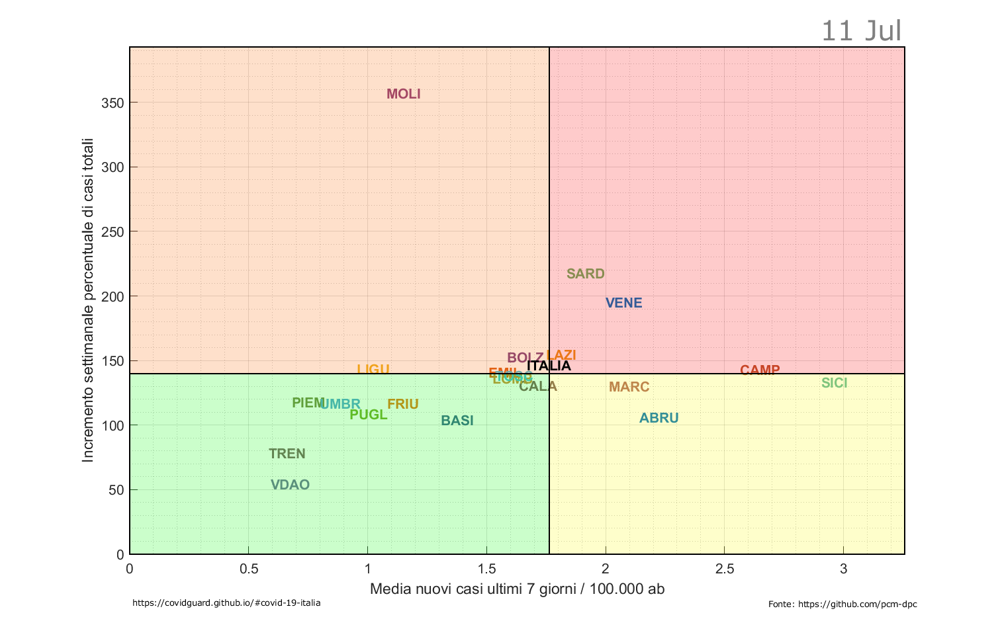

### Confronto casi testati / numero casi positivi
Il grafico riporta il confronto tra regioni relativo all'ultima settimana riguardo il numero di nuovi casi testati e il numero di nuovi casi positivi. 
Se la Regione si trova nella zona rossa significa che sta praticando un numero insufficiente di test.
Se la Regione si trova nella zona gialla significa che sta praticando un numero sufficiente di test.
Se la Regione si trova nella zona verde significa che sta praticando un numero sovrabbodante di test.
Se la . N.B.: le conclusioni sono puramente indicative.
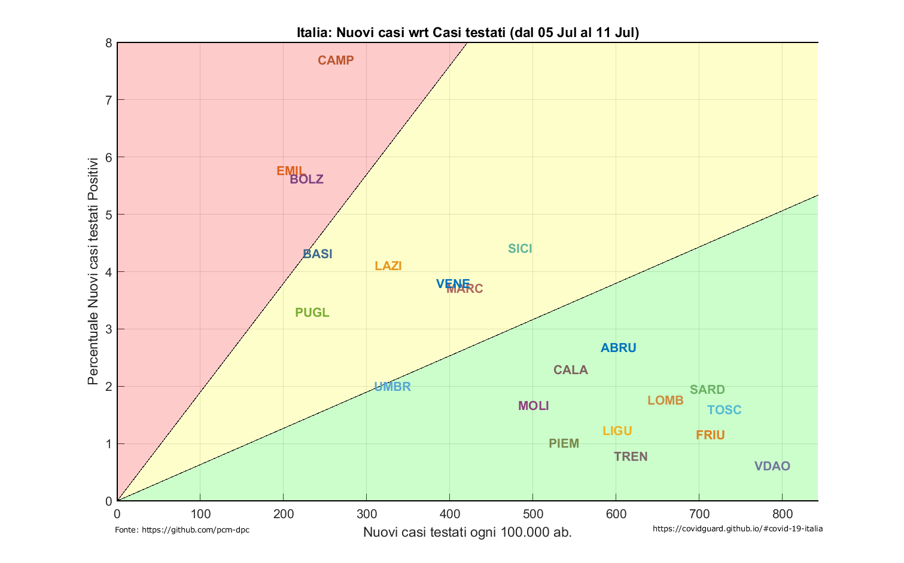

### Andamento epidemia: confronto tra Regioni
Il grafico riporta l'andamento del numero dei casi totali di ogni Regione allineati temporalmente a partire dal caso 10/100.000 di ogni Regione.
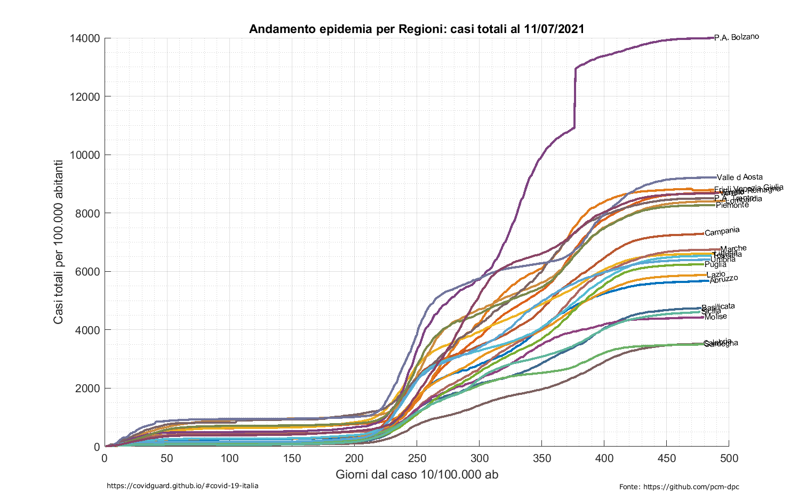

Il grafico riporta l'andamento del numero degli attualmente positivi di ogni Regione.
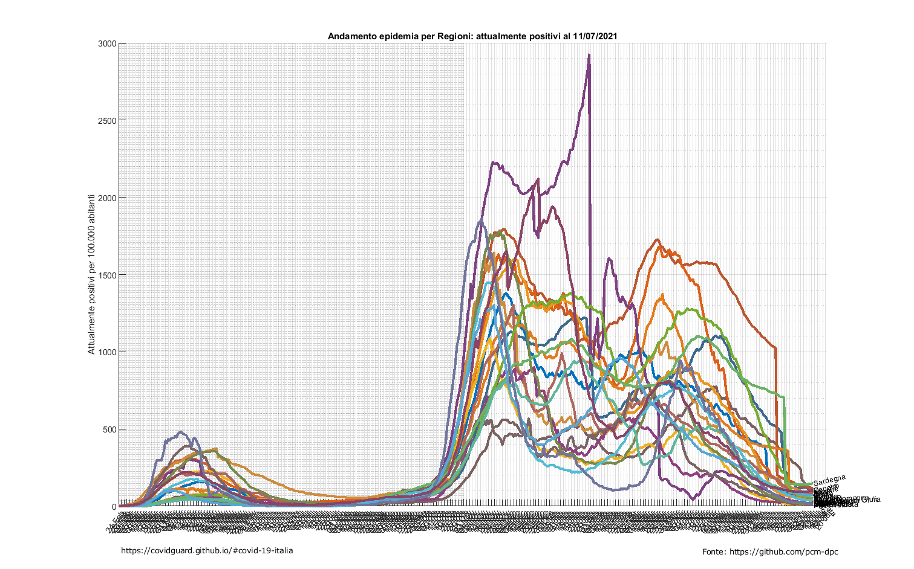

Il grafico riporta l'andamento del numero dei deceduti di ogni Regione.
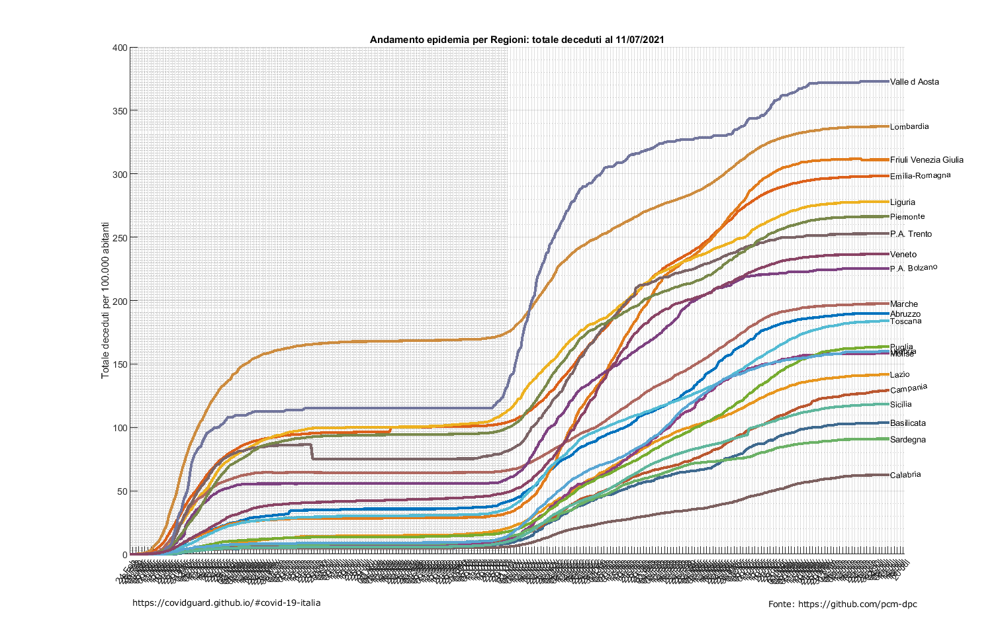

Il grafico riporta l'andamento del numero dei dimessi/guariti di ogni Regione.
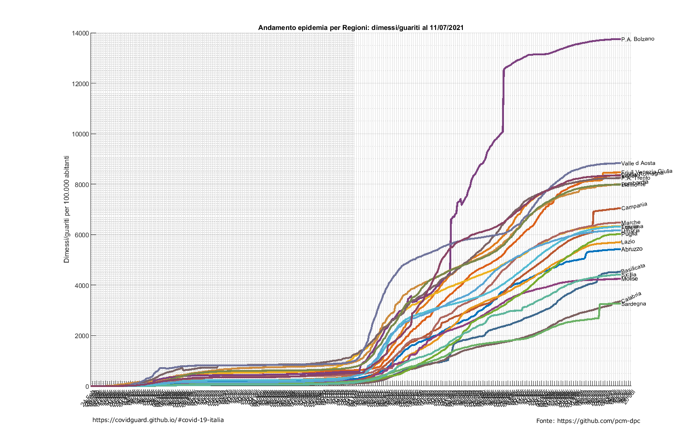

### Trend giorno per giorno
Andamento dei dati giornalieri per casi totali, dimessi, in isolamento domiciliare, ricoverati con sintomi, terapie intensive e deceduti, in due rappresentazioni differenti:

### Italia: Tamponi totali
Numero di tamponi analizzati giorno per giorno su tutto il territorio nazionale e test risultati effettivamente positivi:
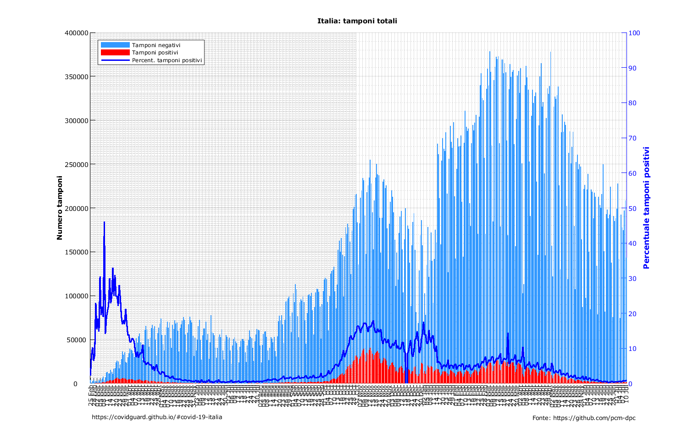

### Italia: percentuale casi testati positivi
Il grafico riporta l'andamento della percentuale di casi testati positivi:

### Italia: totale cumulato totale dei casi
Il grafico mostra l'andamento del numero cumulato di casi:

### Italia: andamento numero positivi
Il grafico riporta il numero di soggetti attualmente positivi:

### Italia: andamento numero terapie intensive
Il grafico riporta l'andamento del numero di soggetti in terapia intensiva:

### Italia: andamento numero ricoverati
Il grafico riporta l'andamento del numero di soggetti ricoverati:

### Italia: rapporto tra terapie intensive e ricoverati
Il grafico riporta l'andamento del rapporto tra soggetti in terapia intesiva e altri ricoverati:

### Italia: rapporto tra totale ricoverati e casi totali
Il grafico riporta l'andamento del rapporto tra soggetti ricoverati sui casi totali:

### Italia: Esito
Relazione tra deceduti e dimessi/guariti:
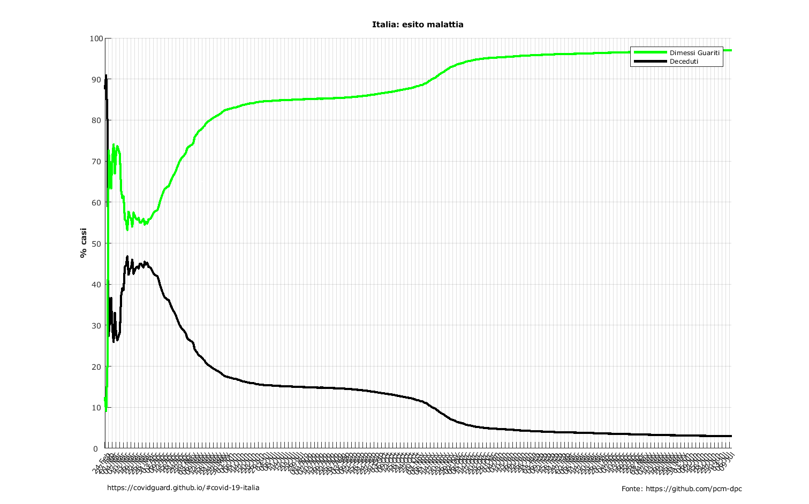

### Italia: Casi vs Decessi
Tra i primi sintomi (tampone positivo) e il decesso trascorrono da 4 a 8 giorni. 
Di seguito due rappresentazioni: 
- correlazione tra nuovi casi giornalieri e deceduti gionalieri:

- correlazione tra i relativi incrementi percentuali:

## ITALIA Regioni

### Confronto temporale tra Regioni

### Aumento settimanale
Per ogni regione Italiana qui si possono vedere gli incrementi a 7 giorni del numero di nuovi casi ogni 100.000 abitanti

### Confronto Regioni
Per ogni regione Italiana qui si possono vedere i dati dei seguenti parametri osservati:

* Totale attualmente positivi
* Totale ospedalizzati
* Ricoverati con sintomi
* Terapia intensiva
* Deceduti
* Isolamento domiciliare
* Guariti dimessi
* Tamponi
* Totale casi

Grafici comparativi di tutte le regioni

<iframe class="slideshow-iframe" src="/slides/regioni_recap.html" 
style="width:100%;" frameborder="0" scrolling="no" onload="resizeIframe(this)"></iframe>

Grafici comparativi con dati normalizzati per 100.000 abitanti

<iframe class="slideshow-iframe" src="/slides/regioni_recap_norm.html" 
style="width:100%;" frameborder="0" scrolling="no" onload="resizeIframe(this)"></iframe>

<iframe class="slideshow-iframe" src="/slides/italia-regioni-confronto-day.html" 
style="width:100%" frameborder="0" scrolling="no" onload="resizeIframe(this)"></iframe>

<iframe class="slideshow-iframe" src="/slides/italia-regioni-confronto-week.html" 
style="width:100%" frameborder="0" scrolling="no" onload="resizeIframe(this)"></iframe>

### Dati giornalieri cumulati

<iframe class="slideshow-iframe" src="/slides/regioni_cum.html" 
style="width:100%;" frameborder="0" scrolling="no" onload="resizeIframe(this)"></iframe>

### Dati giornalieri cumulati - rappresentazione alternativa

<iframe class="slideshow-iframe" src="/slides/regioni_cum_bars.html" 
style="width:100%;" frameborder="0" scrolling="no" onload="resizeIframe(this)"></iframe>

### Progressione Giornaliera

<iframe class="slideshow-iframe" src="/slides/regioni_day.html" 
style="width:100%" frameborder="0" scrolling="no" onload="resizeIframe(this)"></iframe>

### Tamponi totali
Numero di tamponi vs numero risultati positivi

<iframe class="slideshow-iframe" src="/slides/regioni_tamponi.html" 
style="width:100%" frameborder="0" scrolling="no" onload="resizeIframe(this)"></iframe>

### Tamponi: Casi testati
Numero di tamponi testati vs numero risultati positivi

<iframe class="slideshow-iframe" src="/slides/regioni_tamponi-testati.html" 
style="width:100%" frameborder="0" scrolling="no" onload="resizeIframe(this)"></iframe>

### Esito
Percentuale dei dimessi/guariti sui casi che hanno avuto un esito.
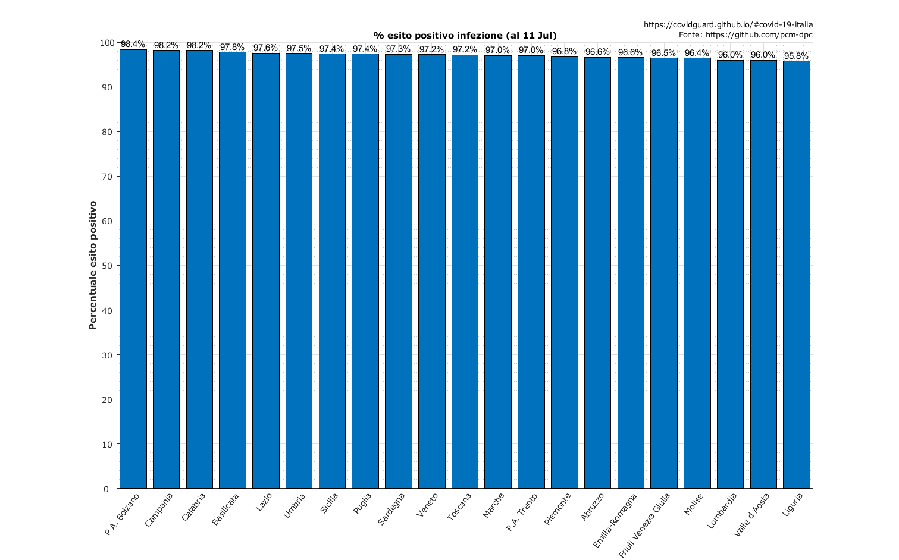

<iframe class="slideshow-iframe" src="/slides/regioni_esito.html" 
style="width:100%" frameborder="0" scrolling="no" onload="resizeIframe(this)"></iframe>

### Indice di mortalità 
Indice di mortalità calcolato sui casi totali, ovviamente il valore reale è molto più basso, i casi totali conteggiati sono solamente dati dal totale delle persone a cui un tampone è risultato positivo, come noto i casi sommersi sono molti. I valori del grafico sono quindi molto dipendenti dal numero di tamponi effettuati regione per regione:
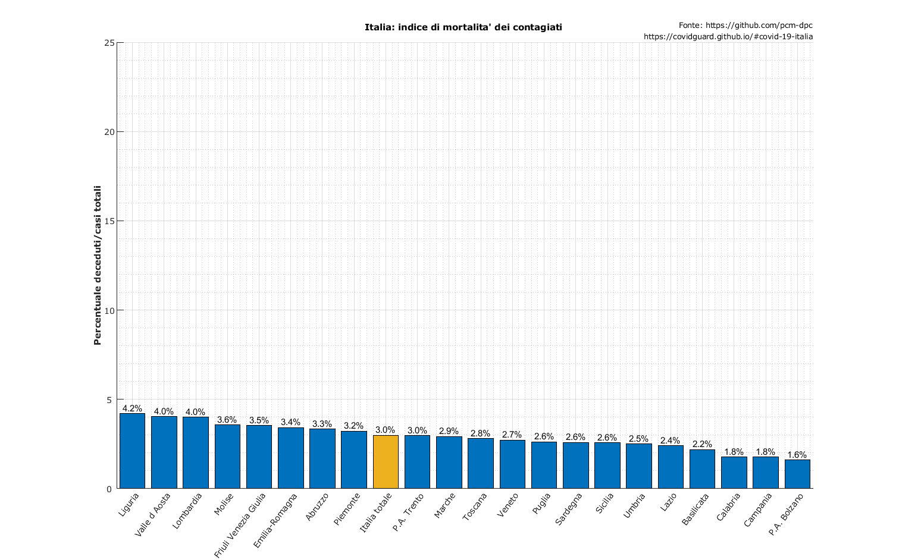

Rapporto deceduti su casi totali:
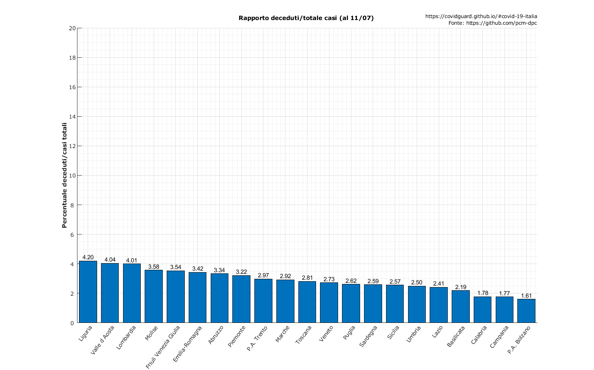

## ITALIA Province

Per le province di ogni regione Italiana al momento sono disponibili solo i casi positivi totali.

### Incrementi a 7 giorni delle province
Per ogni Regione viene mostrato l'andamento degli incrementi a 7 giorni dei nuovi casi ogni 100.000 abitanti. 
<iframe class="slideshow-iframe" src="/slides/province_status.html" 
style="width:100%" frameborder="0" scrolling="no" onload="resizeIframe(this)"></iframe>

### Le 15 Province con più contagi negli ultimi 7 giorni
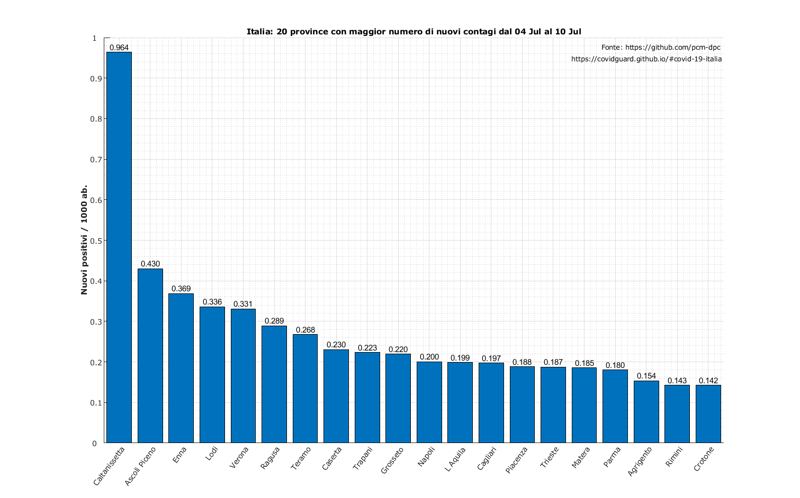

### Le 15 Province con meno contagi negli ultimi 7 giorni
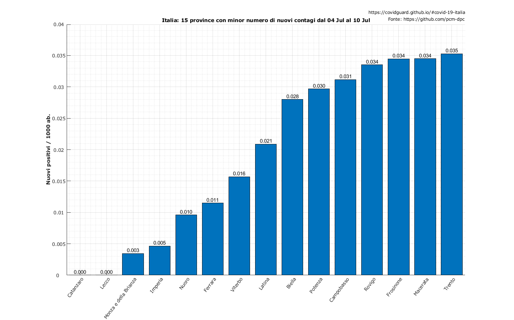

### Dati di progressione percentuale

Questi grafici permettono di osservare l'andamento percentuale di crescita (o decrescita) del numero di positivi totali

<iframe class="slideshow-iframe" src="/slides/province_prog.html" 
style="width:100%" frameborder="0" scrolling="no" onload="resizeIframe(this)"></iframe>

### Dati giornalieri cumulati

<iframe class="slideshow-iframe" src="/slides/province_cum.html" 
style="width:100%" frameborder="0" scrolling="no" onload="resizeIframe(this)"></iframe>

### Dati giornalieri cumulati normalizzati per popolazione

<iframe class="slideshow-iframe" src="/slides/province_norm.html" 
style="width:100%" frameborder="0" scrolling="no" onload="resizeIframe(this)"></iframe>

### Progressione Giornaliera

<iframe class="slideshow-iframe" src="/slides/province_day.html" 
style="width:100%" frameborder="0" scrolling="no" onload="resizeIframe(this)"></iframe>

## LOMBARDIA
La Regione Lombardia è il territorio più colpito dall'epidemia. Nei grafici seguenti si riportano gli andamenti per questa particolare Regione.

### Trend regionale giorno per giorno 
Andamento dei dati giornalieri per casi totali, dimessi, in isolamento domiciliare, ricoverati con sintomi, terapie intensive e deceduti:
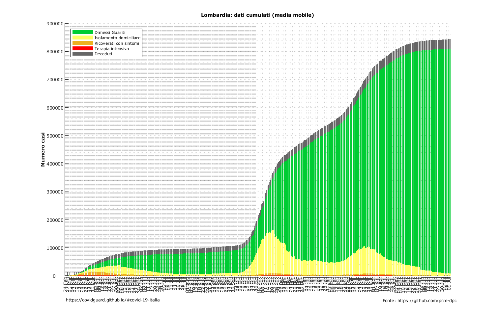

### Numero cumulato di positivi regionale
Il grafico riporta l'andamento dei casi positivi cumulati:

### Numero giornaliero di nuovi casi positivi
La modellazione del numero dei nuovi casi positivi giornalieri risulta poco accurata a causa della difformità nel tempo delle regole di somministrazione dei tamponi, del loro numero giornaliero e delle latenze nei risultati. Tuttavia può dare una informazione grossolana sul suo andamento:

### Attualmente positivi regionale
Il grafico riporta l'andamento del numero di soggetti attualmente positivi

### Confronto Lombardia-Resto d'Italia: casi giornalieri
I grafici riportano il confronto negli andamenti tra la Lombardia e il resto d'Italia
<iframe class="slideshow-iframe" src="/slides/lombardia-italia-confronto.html" 
style="width:100%" frameborder="0" scrolling="no" onload="resizeIframe(this)"></iframe>

### Curve epidemiche provinciali
L'interpolazione delle serie di crescita dei nuovi casi provinciali permette di valutare gli andamenti Provincia per Provincia della Regione.
Le curve soffrono ovviamente della estrema variabilità delle condizioni di rilevamento dei dati (tamponi, tipologia di persone analizzate, ...) e sono poco rappresentative nella parte di crescita, tuttavia mostrano inequivolcabilmente come, in praticolare in Provincia di Lodi ma anche nelle Province di Cremona e Pavia, l'epidemia fosse iniziata un periodo molto antecedente il primo caso ufficiale.
In particolare il caso 1 italiano (circa 20 febbraio) era in corrispondenza quasi del picco di contagi della Provincia lodigiana.

### Dati comunali: totale casi
Per ogni Provincia lombarda vengono riportati i 25 Comuni con numero maggiore di casi
<iframe class="slideshow-iframe" src="/slides/lombardia-comuni-totali.html" 
style="width:100%" frameborder="0" scrolling="no" onload="resizeIframe(this)"></iframe>

### Dati comunali: totale casi pesati per popolazione
Per ogni Provincia lombarda vengono riportati i 25 Comuni con numero maggiore di casi in rapporto alla popolazione comunale
<iframe class="slideshow-iframe" src="/slides/lombardia-comuni-totali-pesati.html" 
style="width:100%" frameborder="0" scrolling="no" onload="resizeIframe(this)"></iframe>

### Dati comunali: progressione giornaliera
Per ogni Provincia lombarda vengono riportati i 25 Comuni con numero maggiore di nuovi casi giornalieri (si noti che l'aggiornamento non avviene sempre giornalmente).
<iframe class="slideshow-iframe" src="/slides/lombardia-comuni-nuovi.html" 
style="width:100%" frameborder="0" scrolling="no" onload="resizeIframe(this)"></iframe>

## MONDO

### Andamento giornaliero casi e decessi
Infine uno sguardo sul mondo: i grafici riportano i Paesi con il maggior numero di casi e decessi pesati per popolazione:

[Back to the Table of Contents](#table-of-contents)

# Contatti

info.covidguard[at]protonmail.com
